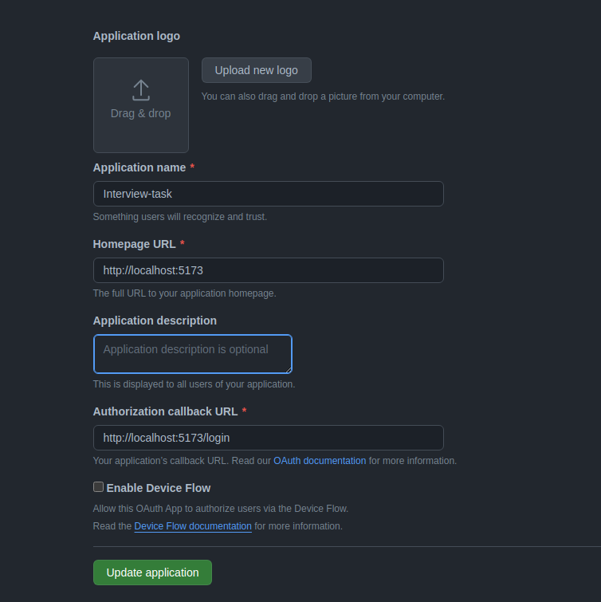

# Backend App Readme

## Description

This backend application serves as a proxy to save starred repositories and periodically collects commit count. It utilizes Docker for easy deployment and relies on environment variables specified in a `.env.development` file.

## Pre-requisites

Creating an oauth app: <https://docs.github.com/en/apps/oauth-apps/building-oauth-apps/creating-an-oauth-app>
Docker and docker compose
NVM in case the migrations are executed locally and not inside the container <https://github.com/nvm-sh/nvm>

Configuring the oauth app:


## Setup

To run the project, follow these instructions:

1. Create a `.env.development` file based on the provided `.env` template.

    ```bash
    cp .env .env.development
    ```

   Fill in the necessary values in the `.env.development` file.

2. Build and run the application using Docker Compose.

    ```bash
    docker-compose up -d --build
    ```

The migrations run automatically when the app starts. To manually run the migrations or revert (should have installed node modules locally first using npm install)

```bash
npm run migration:run / npm run migration:revert
```

or run migrations inside the container by opening the docker terminal and running these commands:

```bash
npm run migration:run:docker / npm run migration:revert:docker
```

This sets up the environment, builds the Docker containers, and migrates the database.

## Docker Compose

The provided `docker-compose.yml` file sets up the necessary containers for the application. The `-d` flag runs the containers in the background.
